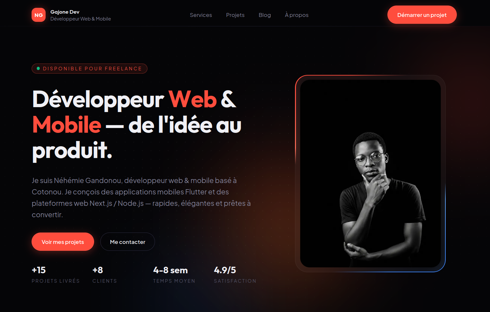

<div align="center">

# Portfolio — Néhémie Gandonou (Gajone Dev)

**Développeur Web & Mobile — de l'idée au produit.**

Mon portfolio personnel : je suis Néhémie Gandonou, développeur freelance basé à
Cotonou, Bénin. Un site pensé pour la performance, l'élégance et la conversion.

[](https://nextjs.org)
[](https://react.dev)
[](https://www.typescriptlang.org)
[](https://tailwindcss.com)
[](https://www.framer.com/motion/)
[](#-licence)

[**🌐 Site en ligne →**](https://gajone.dev)



</div>

---

## ✨ Aperçu

Mon site vitrine de développeur fullstack web & mobile. J'ai mis l'accent sur une
**direction artistique soignée** (thème « Neon Dark », accent corail), des
**micro-interactions travaillées** (border-beam, spotlight cards, parallax au
curseur) et une **performance mesurée** (animations d'entrée pilotées en CSS pour
ne pas bloquer le LCP, blur retiré des grands éléments animés).

Le site est entièrement en **français** (`fr_BJ`) et inclut un blog, des pages
légales, une page SEO dédiée et un formulaire de contact sécurisé.

---

## 🚀 Fonctionnalités

- **Next.js 16 App Router** — React Server Components, Server Actions, rendu statique.
- **Design system par remapping de tokens** — des variables CSS sémantiques sont
  remappées par section via les classes `.section-dark` / `.section-light`
  (pas de toggle clair/sombre, le markup s'adapte tout seul).
- **Animations signature**
  - _Hero_ : reveal mot-à-mot piloté en **CSS** (joue dès la première frame, sans
    attendre l'hydratation → LCP préservé), border-beam à double trace autour du portrait.
  - _Spotlight cards_ : glow qui suit le curseur avec **parallax** (cœur rapide,
    halo lent) et corner-light alternée — implémenté en `requestAnimationFrame`
    pour éviter un bug de repaint Firefox.
  - _Aurora_ + dot pattern en fond de hero.
  - _Carrousel de témoignages_ swipeable (drag/tactile), autoplay, pastilles.
- **Formulaire de contact sécurisé** — `react-hook-form` + `zod`, envoi par e-mail
  via **Resend**, et anti-bot multi-couches : honeypot, time-trap, rate-limit par IP,
  et **Cloudflare Turnstile** (vérification serveur _fail-closed_).
- **Blog en Markdown** — contenu dans `content/blog/`, parsé avec `gray-matter` + `remark`.
- **SEO** — métadonnées par page, `sitemap.xml`, OpenGraph image, page d'atterrissage
  dédiée (`/developpeur-web-benin`).
- **Analytics** — Vercel Analytics + Speed Insights.
- **Accessibilité & confort** — respect de `prefers-reduced-motion`.

---

## 🧱 Stack technique

| Domaine        | Technologies                                                                                             |
| -------------- | -------------------------------------------------------------------------------------------------------- |
| Framework      | [Next.js 16](https://nextjs.org) (App Router), [React 19](https://react.dev)                             |
| Langage        | [TypeScript 5](https://www.typescriptlang.org)                                                           |
| Styles         | [Tailwind CSS 4](https://tailwindcss.com) (`@theme`, tokens CSS)                                         |
| Animations     | [Framer Motion 12](https://www.framer.com/motion/) + keyframes CSS                                       |
| Formulaires    | [react-hook-form](https://react-hook-form.com) + [Zod](https://zod.dev)                                  |
| E-mail         | [Resend](https://resend.com)                                                                             |
| Anti-bot       | [Cloudflare Turnstile](https://www.cloudflare.com/products/turnstile/)                                   |
| Contenu / Blog | Markdown + [gray-matter](https://github.com/jonschlinkert/gray-matter) + [remark](https://remark.js.org) |
| Icônes         | [lucide-react](https://lucide.dev)                                                                       |
| Analytics      | [@vercel/analytics](https://vercel.com/analytics) + Speed Insights                                       |

---

## 📁 Structure du projet

```
.
├── app/
│   ├── about/                  # Page « À propos »
│   ├── actions/                # Server Actions (envoi du formulaire de contact)
│   ├── blog/                   # Liste + pages d'article ([slug])
│   ├── contact/                # Page contact + formulaire
│   ├── developpeur-web-benin/  # Landing SEO
│   ├── mentions-legales/       # Pages légales
│   ├── politique-confidentialite/
│   ├── projects/               # Projets réalisés
│   ├── services/               # Offres de service
│   ├── components/
│   │   ├── sections/           # Sections de page (Hero…)
│   │   ├── ui/                 # Composants UI (SpotlightCard, GlowButton, ContactForm…)
│   │   └── layout/             # Header / Footer
│   ├── globals.css             # Tokens, thèmes, effets signature
│   ├── layout.tsx              # Layout racine + métadonnées
│   ├── opengraph-image.png     # Image OpenGraph
│   └── sitemap.ts              # Génération du sitemap
├── content/blog/               # Articles de blog (Markdown)
├── data/                       # Source de vérité unique (projets, services, skills, SEO…)
├── lib/                        # Helpers (animations, blog, schéma de contact, icônes)
├── public/                     # Assets statiques (portrait, etc.)
└── next.config.ts
```

> Les contenus (projets, services, compétences, témoignages, navigation) sont
> centralisés dans `data/` : **une seule source de vérité**, pas de duplication
> entre l'aperçu et les pages détaillées.

---

## 🛠️ Démarrage

### Prérequis

- **Node.js ≥ 20**
- **pnpm** (recommandé — le repo utilise `pnpm-lock.yaml`). `npm` fonctionne aussi.

### Installation

```bash
git clone https://github.com/gajonedev/my-portfolio.git
cd my-portfolio
pnpm install
```

### Variables d'environnement

Copie le fichier d'exemple puis renseigne tes clés :

```bash
cp .env.example .env.local
```

| Variable                         | Rôle                                                      | Requis |
| -------------------------------- | --------------------------------------------------------- | :----: |
| `RESEND_API_KEY`                 | Clé API Resend (envoi des e-mails)                        |   ✅   |
| `CONTACT_FROM_EMAIL`             | Expéditeur (domaine vérifié sur Resend)                   |   ✅   |
| `CONTACT_TO_EMAIL`               | Adresse de réception des messages                         |   ✅   |
| `NEXT_PUBLIC_TURNSTILE_SITE_KEY` | Clé publique Cloudflare Turnstile (exposée au navigateur) |   ✅   |
| `TURNSTILE_SECRET_KEY`           | Clé secrète Turnstile (serveur uniquement)                |   ✅   |

> 💡 **Dév local sans configuration** : Cloudflare fournit des clés de test qui
> passent toujours la vérification — voir les valeurs commentées dans
> `.env.example`. Sans `RESEND_API_KEY`, le formulaire valide tout côté client
> mais l'envoi échouera proprement.

### Lancer le projet

```bash
pnpm dev      # serveur de développement → http://localhost:3000
pnpm build    # build de production
pnpm start    # sert le build de production
pnpm lint     # ESLint
```

---

## 📨 Formulaire de contact & anti-bot

L'envoi passe par une **Server Action** (`app/actions/contact.ts`) qui applique
les couches suivantes, dans l'ordre :

1. **Honeypot** — un champ caché que seuls les bots remplissent.
2. **Time-trap** — un envoi trop rapide (< 3 s après l'affichage) est rejeté.
3. **Validation Zod** — schéma partagé client/serveur (`lib/contact-schema.ts`).
4. **Rate-limit par IP** — 3 messages / 60 s (en mémoire).
5. **Cloudflare Turnstile** — vérification serveur _fail-closed_ (siteverify).
6. **Resend** — envoi de l'e-mail avec `replyTo` sur l'adresse du visiteur.

---

## ✍️ Ajouter un article de blog

Crée un fichier Markdown dans `content/blog/`, avec un frontmatter :

```markdown
---
title: "Titre de l'article"
date: "2026-06-23"
excerpt: "Résumé court affiché dans la liste."
---

Le contenu de l'article en **Markdown** (GitHub Flavored supporté).
```

Le slug correspond au nom du fichier (`mon-article.md` → `/blog/mon-article`).

---

## ☁️ Déploiement

Optimisé pour **[Vercel](https://vercel.com)** :

1. Importe le dépôt sur Vercel.
2. Renseigne les variables d'environnement (cf. tableau ci-dessus).
3. Déploie — Vercel détecte Next.js automatiquement.

Tout hébergeur supportant Next.js 16 convient également.

---

## 🤝 Contribution

Ce dépôt est avant tout mon portfolio personnel, mais vos retours, suggestions et
corrections sont les bienvenus — ouvrez une _issue_ ou une _pull request_.

> ⚠️ Les **contenus** (textes, projets, photo, témoignages) sont les miens.
> Réutilisez librement le **code et l'architecture**, mais remplacez mes contenus
> personnels par les vôtres.

---

## 📄 Licence

Distribué sous licence **MIT**. Voir le fichier [`LICENSE`](./LICENSE).

---

## 👤 Auteur

**Néhémie Gandonou** — _Gajone Dev_
Développeur Web & Mobile · Cotonou, Bénin

- 🌐 [gajone.dev](https://gajone.dev)
- 🐙 [github.com/gajonedev](https://github.com/gajonedev)
- 💼 [linkedin.com/in/gajonedev](https://linkedin.com/in/gajonedev)
- ✉️ gajonedev@gmail.com

<div align="center"><sub>Conçu et développé avec soin — pas de produit au rabais.</sub></div>
